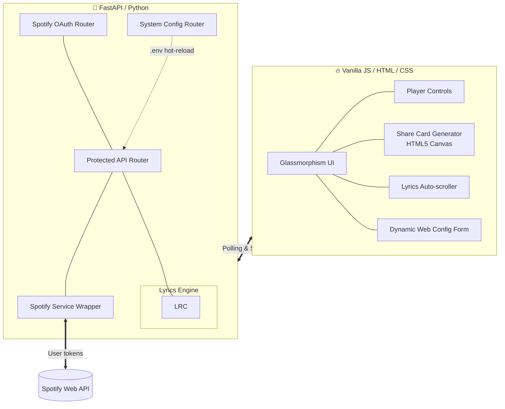

# Lyrica — Spotify Lyrics App 🎵

Lyrica 是一个基于 **FastAPI (Python)** 和 **Vanilla JS** 构建的全栈 Web 应用程序。它能够与您当前的 Spotify 播放状态实时同步，利用多级智能匹配引擎抓取歌词，并提供令人惊艳的、具玻璃拟物和发光特效的动态 UI 体验。
~~除了功能强大的播放器本体，Lyrica 还有一个独立的官方独立宣传网页（Standalone Landing Page）。~~

---

## ✨ 核心特性

- **🟢 Spotify 实时无缝同步**  
  无缝连接您的 Spotify Premium/Free 账号，实时追踪当前正在播放的曲目、进度及播放状态。
- **🎤 瀑布式智能歌词引擎 (多源兜底)**  
  我们在其后配置了多歌词源作为多级兜底。这使得 Lyrica 能够毫秒级找齐不仅限于欧美热门，更涵盖了**华语流行、独立音乐、Live 版及纯音乐**的精准滚动时间轴歌词。
- **📸 杂志风·歌词分享卡片 (Editorial Share Card)**  
  不依赖第三方生图服务，前端基于纯粹的 HTML5 Canvas 技术，动态生成带有高斯模糊专辑背景、左齐光晕文字、专属绿线点阵点缀和完整圆角的精美分享海报。支持通过横向 Chip 选择器任意调整要高亮的歌词金句，具备智能长文裁字及排版换行。
- **🫧 极致 UI 体验 (Glassmorphism & 3D Parallax)**  
  深色模式，使用毛玻璃特效（Glassmorphism）搭建模块，背景随专辑封面动态渲染且有柔和律动的彩色 Blobs，随播放暂停平滑过渡。独立官网更是搭载了随着鼠标 3D 悬浮视差的精美控件与原生 CSS Marquee 跑马灯组件。
- **⚙️ 傻瓜式动态配置 (Zero Manual Config)**  
  极度小白友好的 Web 引导。首次使用**无需手动新建或修改 `.env` 环境变量文件**！直接启动应用，页面将自动弹出一个精美的玻璃态配置表单，在网页填入 `Client ID` 和 `Secret` 后即可热更新，立即开启音乐之旅。

---

## 🏗️ 系统架构图



---

## 🛠️ 项目结构与技术栈

- **`lyrica/`**: 主播放层应用逻辑。
  - **Backend**: Python 3.9+, [FastAPI](https://fastapi.tiangolo.com/), `spotipy`, `httpx` (异步并发网络), `pydantic`, `python-dotenv`。
  - **Frontend**: 采用 0 框架搭建 (`frontend/index.html`)，极简高性能的原生 JS 和 Vanilla CSS Variables，原生支持 Canvas API。
~~- **`lyrica_website/`**: 附带的创意宣传官方网页，也是独立的静态项目。使用了原生 IntersectionObserver 实现滚动揭开（Scroll Reveal），以及 Bento Box 便当盒网格布局。~~

---

## 🚀 部署与运行指南

### 1. 准备 Spotify 开发者应用
前往 [Spotify Developer Dashboard](https://developer.spotify.com/dashboard)：
1. Create App (创建新应用)
2. 设置 **Redirect URI** 为 `http://127.0.0.1:666/callback`
3. 取得 `Client ID` 和 `Client Secret`

### 2. 启动服务 (无需提前设置环境变量)
克隆代码库并进入项目的主后端目录 `lyrica`。

```bash
# 激活虚拟环境 (可选)
python -m venv .venv
.venv\Scripts\activate

# 安装依赖
pip install -r requirements.txt

# 启动 FastAPI 后端（固定在 666 端口）
uvicorn main:app --reload --port 666
```

### 3. 网页初始化配置
1. 在浏览器打开：[http://127.0.0.1:666](http://127.0.0.1:666)
2. 您会直接看到一个炫酷的 **「App Configuration」** 表单。
3. 将第一步中获得的 `Client ID` 和 `Client Secret` 直接粘贴进去并点击「Save & Login」。系统会自动生成 `.env` 并在后台热加载！您已经被成功绑定，接下来即可享受极致的同步歌词体验。

---

## 🔗 后端 API 接口概览

| 接口路线 | 方法 | 描述 |
|:---|:---:|:---|
| `/auth/login` | GET | 开启 Spotify OAuth 授权流程 |
| `/auth/callback` | GET | 处理 Spotify 授权回调请求，存取 Token |
| `/auth/status` | GET | 返回当前会话登录状态、Spotify 用户名及头像 |
| `/auth/logout` | GET | 登出并清理会话缓存 |
| `/api/config/status` | GET | 检查当前 `.env` 的配置信息是否到位 |
| `/api/config/setup` | POST | 在网页端重写 `.env` 并执行热重载的表单接收器 |
| `/api/current-track` | GET | **核心接口**：获取当前播放媒体，包含串联执行的三重拦截歌词源和音频特征(Audio Features) |
| `/api/player/{action}` | POST | 播放器控制器（单曲/切歌/循环等）|

> **Made out of ❤️ for music and code.**
